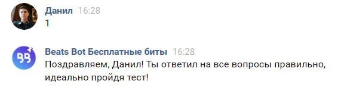

.. Dan documentation master file, created by
   sphinx-quickstart on Wed Jan 29 16:18:59 2020.
   You can adapt this file completely to your liking, but it should at least
   contain the root `toctree` directive.
.. toctree::
   :maxdepth: 3
   :numbered:
   :hidden:

   index
   example1

.. contents:: Содержание
   :depth: 3
Beats Bot Бесплатные биты
================================
https://vk.com/im?media=&sel=-44549777

Функции бота
------------------

.. figure:: img/Menu.png
       :scale: 100 %
       :align: center
       :alt: Альтернативный текст

Начало
------------------

Переходим в диалог с ботом.

.. figure:: img/Begin.png
       :scale: 100 %
       :align: center
       :alt: Альтернативный текст

Пройти тест
------------------

Пишем 1.

Получим случайную песню.
------------------

Отправляем 2.

.. figure:: img/name.png
       :scale: 100 %
       :align: center
       :alt: Альтернативный текст

------------------
.. _Далее: example1.html
	Далее_

